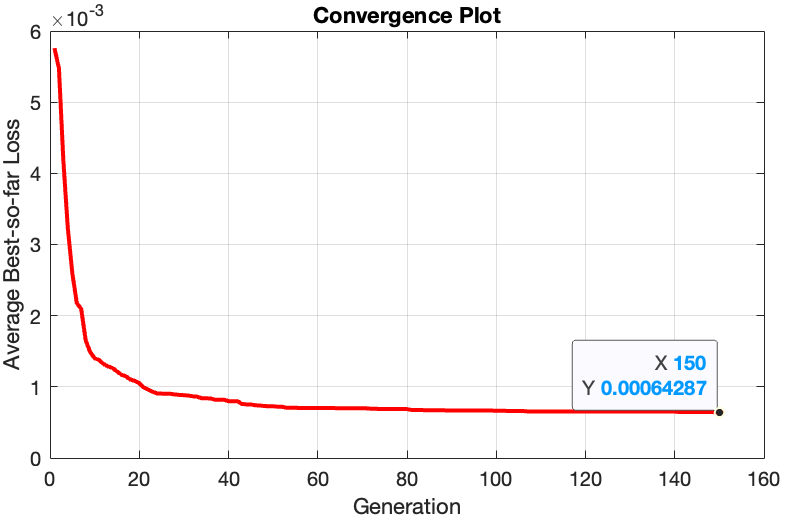
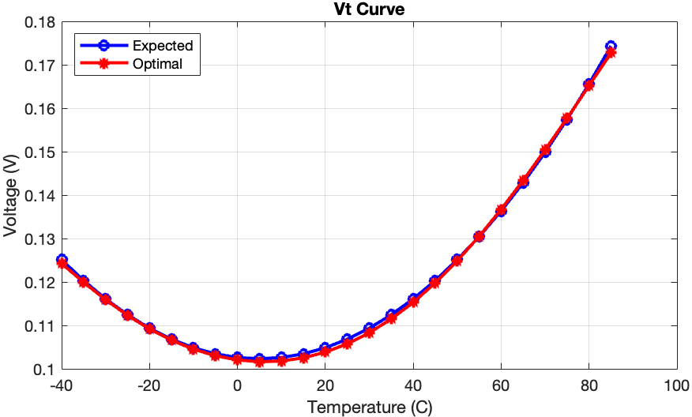
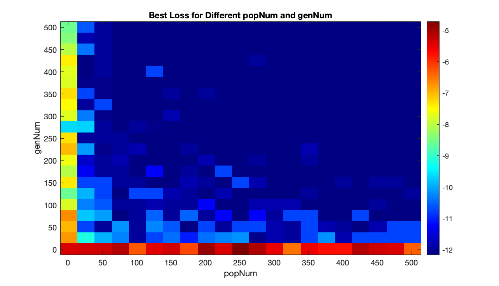

# Project 1: Optimal Component Selection Using Genetic Algorithm

## Disclaimer

This project was created as part of a course requirement for the **University of Glasgow - UESTC Joint School**. The following requirements is from the school. This code was written by myself, with references to resources available on [MATLAB Central](https://uk.mathworks.com/matlabcentral/fileexchange/35810-optimal-component-selection-using-the-mixed-integer-genetic-algorithm).

### Usage Notice
This code is intended for personal and educational use only and should not be distributed or used for commercial purposes.

This project focuses on using a genetic algorithm to optimize the component values (such as resistors and thermistors) for a thermistor circuit. Given that these components are only available in standard sizes, the design variables are integers. The objective is to minimize the difference between the desired response curve and the generated curve from a candidate design. This project explores the design, implementation, and optimization of a genetic algorithm to achieve this goal.

## Problem Description

The objective is to select optimal component values for a thermistor circuit to approximate a desired response curve. A genetic algorithm is used to perform the optimization, with integer-based decision variables representing component values. The primary goals include:
- Minimizing the deviation between the desired and generated response curves.
- Exploring various genetic algorithm parameter settings to improve optimization quality and convergence speed.

More details about the problem and example code can be found on [MATLAB Central](https://uk.mathworks.com/matlabcentral/fileexchange/35810-optimal-component-selection-using-the-mixed-integer-genetic-algorithm).

## Tasks

### 1. Problem Formulation

- **Objective Function and Constraints**: Define the objective function and any constraints based on the provided files.
- **Decision Variables**: Identify decision variables and their search ranges.

### 2. Implement the Genetic Algorithm

- Develop a custom genetic algorithm without using MATLAB's built-in GA functions.
- Perform 10 optimization runs and collect the best, worst, and average optimal objective function values, as well as their standard deviations.
- Display a convergence curve showing the average best objective function values over generations for 10 runs.

### 3. Fine-Tune Genetic Algorithm Parameters

Experiment with various genetic algorithm settings and operators to improve both optimization quality and convergence speed. Document the tuning process, results, and provide an analysis of the performance improvements.

## Results

### Run the code in the repository

Enter the folder with `main.m`. And run `main.m` (for multiple times) to see optimization results. If you want to see how I get those efficient parameters for GA (such as popNum, genNum, crossRate, mutateRate, elitismRate), run `tunerSteady.m` and `tunerDynamic.m` (it may take a LONG time). But the result data of `tunerDynamic.m` is stored in `dynamicTuningData.mat`, you can just run `dynamicHeatMapPlot` to get the heat map directly.

### Main findings

After running the genetic algorithm (GA) optimization over 10 replicates, the following key results were observed:

- **Lowest Loss Achieved**: The minimum loss reached across all runs was $$ L_{\text{min}} = 5.3107 \times 10^{-6} $$
- **Register Configuration at Lowest Loss**:
  - $ R_1 = 5600 \Omega $, $ R_2 = 1800 \Omega $, $ R_3 = 620 \Omega $, $ R_4 = 620 \Omega $
  - Thermistor Parameters: $ R_{N1} = 22000 \Omega $, $ \beta_1 = 4090 \, K $; $ R_{N2} = 50 \Omega $, $ \beta_2 = 2750 \, K $

- **Highest Loss**: $ L_{\text{max}} = 1.1563 \times 10^{-3} $
- **Average Best Loss**: $ L_{\text{avg}} = 6.4287 \times 10^{-4} $
- **Standard Deviation**: $ \sigma = 4.3536 \times 10^{-4} $

### Convergence Plot

The convergence of the best loss across generations averaged over 10 runs is shown in the following figure. The steady decline in loss values demonstrates the effectiveness of the GA in approaching the optimal solution.

### Optimal Voltage-Temperature Curve

The optimal voltage-temperature curve, achieved with the best configuration, closely matches the expected curve, as shown below.

## GA Parameter Tuning

Extensive parameter tuning was conducted to determine the most efficient combination of GA settings, considering:
- **Steady-State Analysis**: Showed that the GA was largely insensitive to crossover, mutation, and elitism rates when the population size and generation count were sufficiently high.

- **Dynamic-State Analysis**: Identified the optimal combination of parameters for convergence efficiency, achieving the best performance with $ \text{popNum} = 201 $, $ \text{genNum} = 151 $, and $ \text{crossRate} = \text{mutateRate} = \text{elitismRate} = 0.2 $.

(Check out `./Results/Report/main.pdf`)

## Resources

- [MATLAB Genetic Algorithm Documentation](https://uk.mathworks.com/help/gads/ga.html)
- [Optimal Component Selection MATLAB File Exchange](https://uk.mathworks.com/matlabcentral/fileexchange/35810-optimal-component-selection-using-the-mixed-integer-genetic-algorithm)

---

**Author**: Mark Ren  
**Institution**: University of Glasgow, UESTC